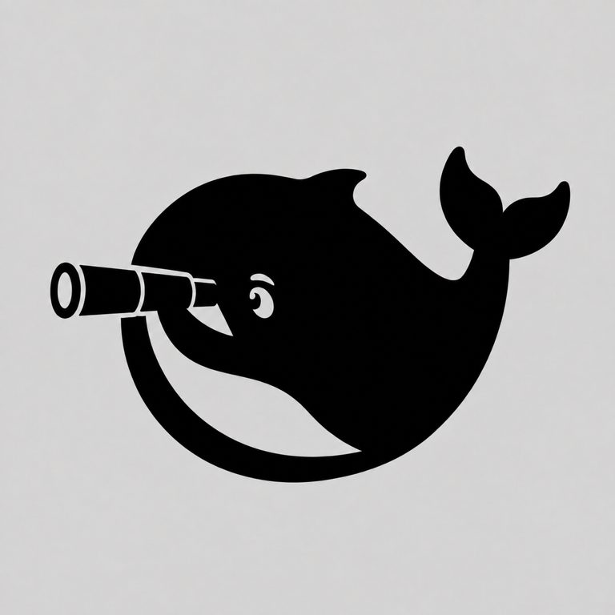

<p align="center">
  
</p>

<h1 align="center">dsh-open-eyes</h1>

<p align="center"><strong>Let the multimodal model you choose become DeepSeek's eyes.</strong></p>

<p align="center">English · <a href="./README.zh-CN.md">中文</a></p>

## What it does

The main model used by DeepSeek Harness does not always support images. When a conversation involves a screenshot, photo, chart, or interface, `dsh-open-eyes` can send the image to a separately configured multimodal model and return its analysis as text to the current conversation.

If the current main model already supports images, the plugin stays out of the way and DSH keeps using its native image path. Images pasted, dropped, or selected in the WebUI are bridged only when the current model is explicitly known not to support images.

The plugin also provides the `vision_analyze` tool for analyzing local image paths and explicitly enabled remote image URLs.

> **Unofficial community plugin:** `dsh-open-eyes` is an independent community project. It is not affiliated with, endorsed by, or maintained by DeepSeek.

Three APIs are supported:

- OpenAI Responses
- OpenAI Chat Completions
- Anthropic Messages

Any vision service that implements one of these APIs can be connected. You choose the endpoint, model, and credentials; the plugin is not tied to a particular provider.

API keys are resolved through DSH Credential References and should never be placed in `cordis.patch.yml`, conversation text, or tool arguments. Local images are workspace-contained by default, and remote image URLs are disabled by default.

> Images handled by the bridge are sent to the third-party provider you configure. Review that provider's retention, privacy, and billing terms before use. Treat the vision model's response as evidence, not as instructions to execute.

## Usage

Requirements:

- Node.js `^22.19.0 || >=24.0.0`
- DeepSeek Harness `0.1.0-rc.6`

DSH profiles are independent. Install and configure the plugin separately in each profile where it is needed.

### Option 1: ask DSH to install it

Send this prompt to DSH:

```text
Install dsh-open-eyes in my web profile and configure vision-bridge.

Use the official installation command:
dsh plugin --profile web add dsh-open-eyes

Use only a Credential Reference in the configuration. Do not put an API key
in YAML or in the conversation. Preserve the existing profile configuration
and do not change unrelated rows.

When finished, run:
dsh --profile web --dump-config

Confirm that vision-bridge and vision-bridge-skill are loaded, then remind me
to restart dsh web and reload the page.
```

### Option 2: install and configure it yourself

Install from npm:

```sh
dsh plugin --profile web add dsh-open-eyes
```

You can also install the tarball attached to a GitHub Release:

```sh
dsh plugin --profile web add ./dsh-open-eyes-0.1.0.tgz
```

Then configure a vision provider in `~/.dsh/profiles/web/cordis.patch.yml`:

```yaml
- id: vision-bridge
  config:
    providers:
      - id: my-vision
        protocol: openai-chat-completions
        baseUrl: https://api.example.com/v1
        model: your-vision-model
        credential: VISION_PROVIDER_API_KEY
        maxOutputTokens: 2048
        chatMaxTokensField: max_completion_tokens
    defaultProvider: my-vision
```

Store `VISION_PROVIDER_API_KEY` in the Credential source used by DSH. Keep only this reference name in the configuration file; do not put the real key there.

Available protocols:

| `protocol` | Default authentication | Notes |
| --- | --- | --- |
| `openai-responses` | Bearer | OpenAI Responses API |
| `openai-chat-completions` | Bearer | Chat Completions API |
| `anthropic-messages` | `x-api-key` | `maxOutputTokens` is required |

Check the configuration:

```sh
dsh --profile web --dump-config
```

After installing or updating the plugin, restart DSH Web and reload the page.

### Start using it

Paste, drop, or select an image in the WebUI, write the question you intended to ask, and send it normally.

The plugin does not add a question on your behalf or expose internal handoff instructions in the user message:

- If the current main model supports images, DSH keeps using its native image path.
- If the current main model explicitly does not support images, the configured vision provider is used.
- If no vision provider is configured, sending stops with a configuration notice and the image is not uploaded.

You can also ask DSH to call `vision_analyze` directly:

```text
Call vision_analyze on screenshots/error.png. Transcribe the exact error code
and describe the actions that are visibly available in the interface.
```

Local PNG, JPEG, WebP, and GIF files are supported. Relative paths are resolved from the current Agent session working directory.

Remote image URLs are disabled by default. Enable them only when needed:

```yaml
allowRemoteUrls: true
```

When enabled, the configured vision provider fetches the image URL. The plugin does not download the remote image locally first.

The example above is the minimum configuration needed for a typical provider. Keep API keys in DSH Credential storage and place only the Credential Reference name in this file.

## Compatibility

- DeepSeek Harness: `0.1.0-rc.6`
- Node.js: `^22.19.0 || >=24.0.0`
- Last verified: `2026-08-15`
- Verified against DeepSeek Harness commit: `47f943859bef60e4160492346772ded9b24f765a`

Web paste integration is pinned to the rc.6 conversation and model-capability seams. Recheck those seams before using the plugin with another DSH release line.

## Uninstall and rollback

Remove the package from the profile where it was installed:

```sh
dsh plugin --profile web remove dsh-open-eyes
```

The command removes the package and its bundle layer. If `~/.dsh/profiles/web/cordis.patch.yml` still contains user-authored rows with the ids `vision-bridge` or `vision-bridge-skill`, remove only those rows and preserve every unrelated entry.

Verify the resulting profile:

```sh
dsh --profile web --dump-config
```

The output should contain neither `vision-bridge` nor `vision-bridge-skill`. Restart DSH Web and reload the browser page afterward.

To return to the current release after testing another build, install its exact version again:

```sh
dsh plugin --profile web add dsh-open-eyes@0.1.0
```
